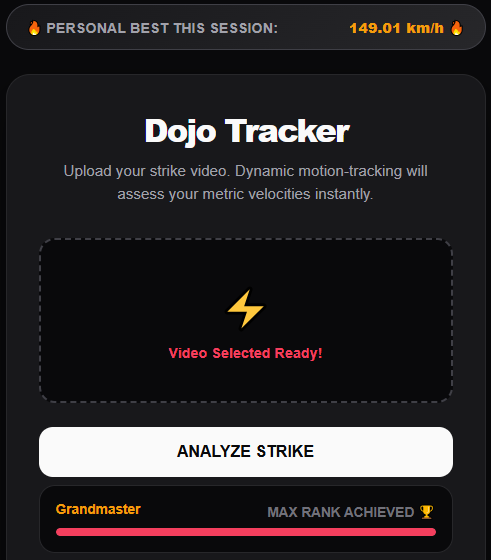
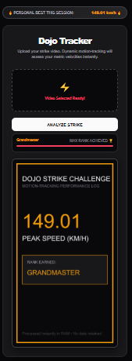

# 🥋 Dojo Tracker: AI Motion-Tracking Strike Analytics

Unleash data-driven martial arts training. Dojo Tracker is a high-performance web application that uses advanced AI motion-tracking to analyze your strike velocities (punches and kicks) instantly. 

Featuring an ultra-sleek, minimalist dark-mode interface with gamified progression mechanics, it turns every training session into an interactive challenge to break your own limits.



---

## ⚡ Key Features

* **🔥 Live Personal Bests:** Built-in high-score tracking saves your session records directly in your browser. It challenges you to beat your best strike every time you upload.
* **🏆 Martial Arts Belt Progression:** Watch your progress bar climb! The system instantly benchmarks your speed and awards you ranks from **White Belt** all the way to **Grandmaster**.
* **📸 Shareable Athlete Cards:** Automatically generates a premium, vertical (9:16) digital performance log showing your peak speed and rank, ready to save or share on social media.
* **🔒 100% Private & Local:** Your videos never touch a cloud server. All frame analysis happens completely in your computer's RAM, keeping your training data entirely yours.

---

## 📸 Interface Sneak Peek



---

## 🛠️ Built With

* **AI Tracking Core:** Google MediaPipe (BlazePose Engine) & OpenCV
* **Backend Pipeline:** FastAPI & Uvicorn (Python 3.11.9)
* **Design System:** Custom HTML5 Vanilla CSS Glassmorphism
* **Graphics Generation:** Pillow (PIL)

---

## 🚀 Quick Start (Get Running in 2 Minutes)

### 1. Set Up Your Environment
Make sure you are running a 64-bit Python environment:
```bash
cd C:\PythonStudio\MartialArts_Speed
.\.venv\Scripts\activate
